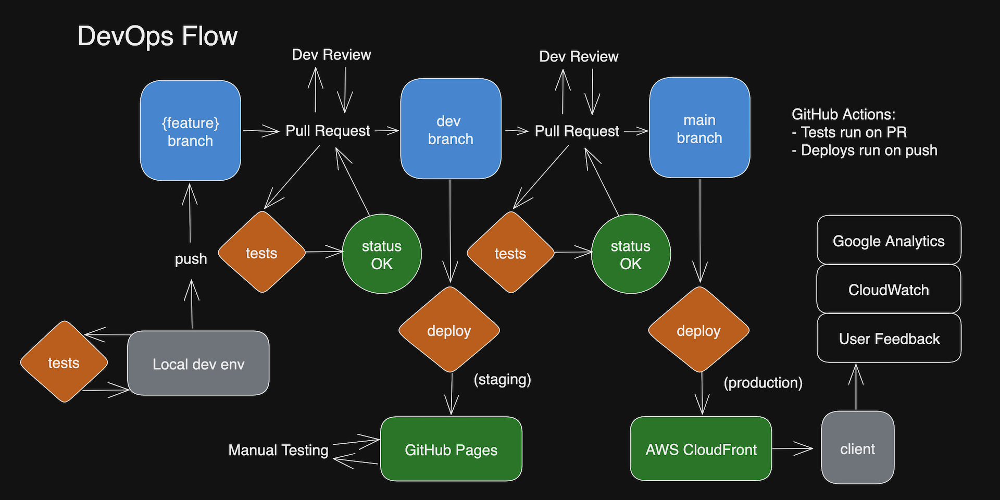

# Health Analytics MX - A.I. Web App

Static site (MPA) built with [Astro](https://astro.build/), React and Bootstrap. Using AWS Cognito for authentication.

## Introduction

Astro benefits:

- Fairly agile TypeScript-first framework with great tooling and integrations.
- No compromises on UI Frameworks.
- Ability to develop for static site generation or server-side rendering.
- File-based routing for content and great Markdown support.

React benefits:

- Best support for any UI framework.
- React Query / TanStack query for API calls.

Bootstrap benefits:

- Fast and easy to develop with.
- Can be customized via SCSS.
- JavaScript for common interactions.

AWS Cognito benefits:

- Integrates well with the Back-End.
- Decent SDK.


## DevOps

Environments:

1. Local environment.
2. Staging environment (GitHub via 'dev' branch).
3. Production environment (AWS via 'main' branch).

All automated testing is done on all Pull Requests of both 'dev' and 'main'. The branch flow is the following: 

{feature} -> dev -> main

### Step by Step DevOps

1. Create any feature branch locally and run any relevant tests.
2. Push to remote and make a Pull Request to 'dev' on GitHub.
3. Once all 'dev' tests pass, review the code and determine whether to merge or not.
4. Once 'dev' is merged, it will deploy to the staging environment. 
5. Perform any manual testing on the staging environment, fixes, etc.
6. If ready to deploy to production, create Pull Request to 'main' on GitHub.
7. Once all 'main' tests pass, review the code and determine whether to merge or not.
8. Once 'main' is merged, it will deploy to production.
9. Any monitoring is done via Google Analytics and AWS CloudWatch.




## Development

### Directories

Following the Astro framework, the main directories in src are:

```shell
src
├── api
├── components
├── content
├── icons
├── images
├── layouts
├── pages
├── scripts
└── styles
```

- API: OpenAPI code-gen output.
- Components: Astro or React components by feature ("database", "login", etc).
- Content: Markdown files for Astro's markdown collections feature.
- Icons: SVG icons.
- Images: PNG and JPEG images.
- Layouts: Generic HTML templates with Header and SEO info. 
- Pages: File-based routing webpages that use Layouts and Components.
- Scripts: JavaScript analytics or fixes scripts loaded by Layouts.
- Styles: CSS and SCSS.

### Tests

All tests go in the ./tests directory. Test frameworks used are Vitest for unit and integration tests, and Playwright for End-to-end tests.

```shell
tests
├── e2e
└── unit
```

### Styles

Using Bootstrap with custom SCSS. Import with Astro in Layout. Alternatively compile with:

```shell
npm run styles
```

### API

Using OpenAPI to generate the schemas and methods exported from FastAPI.

```shell
npm run openapi
```

### Auth

Using AWS SDK for JavaScript.

```shell
amazon-cognito-identity-js
```

### Content

Using Astro's content system for rendering HTML from markdown. 

```js
export async function getStaticPaths() {
    const posts = await getCollection("metrics");
    return posts.map((post) => ({
        params: { slug: post.slug },
        props: { post },
    }));
}
```